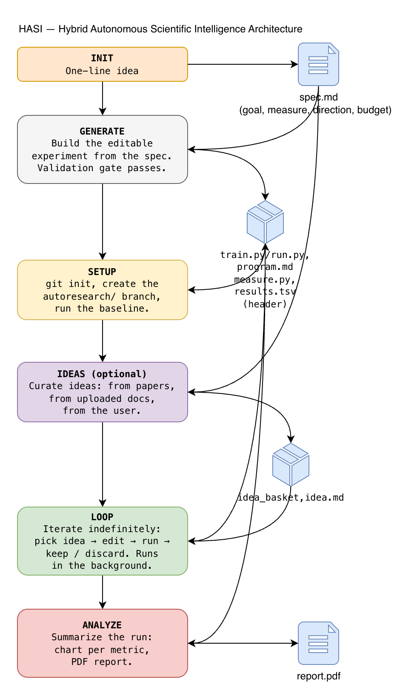
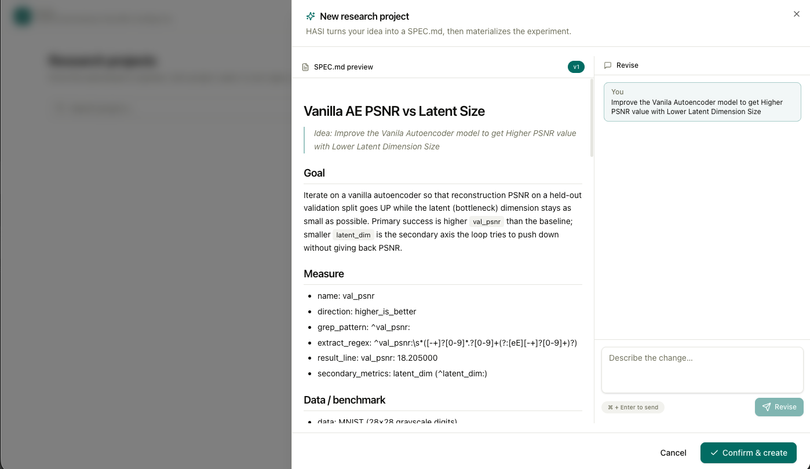
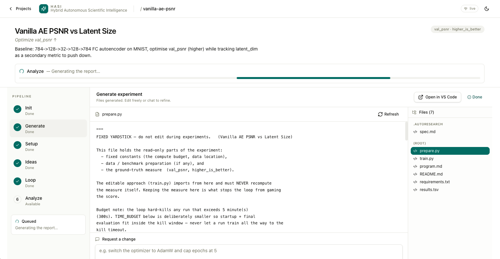
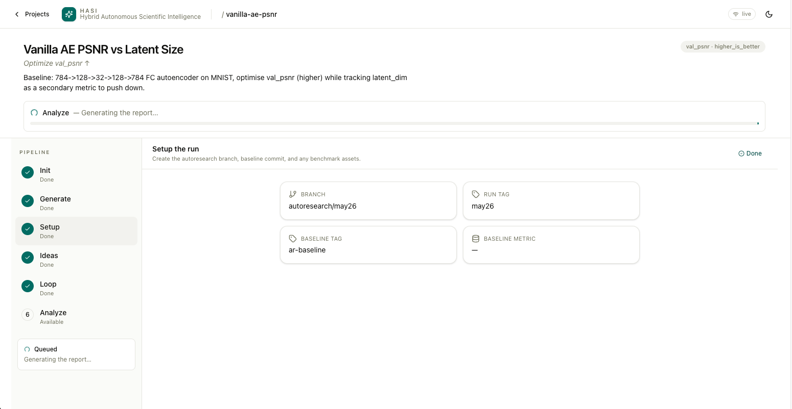
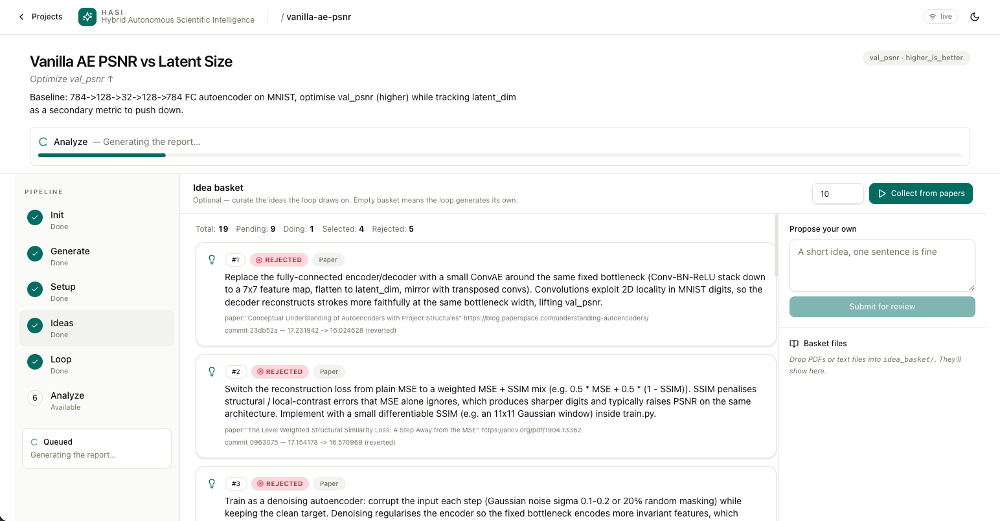
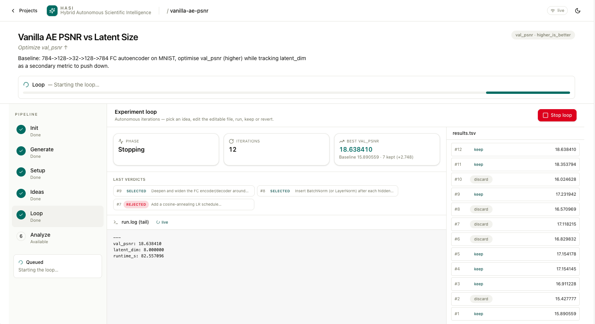
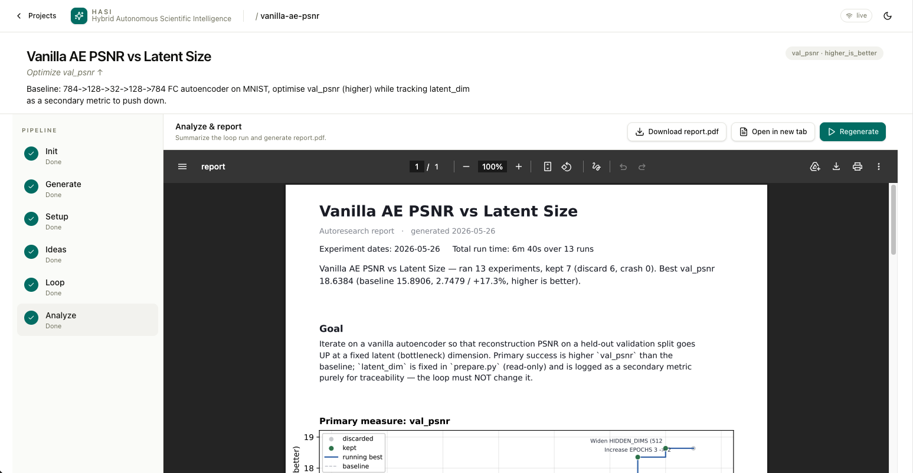

<p align="center">
  
</p>

<h1 align="center">HASI — Hybrid Autonomous Scientific Intelligence</h1>

<p align="center">
  An autonomous improvement framework that helps researchers fine-tune models, algorithms, and simulations through an iterative, human-in-the-loop pipeline.
</p>

---

## Abstract

AI researchers, engineers, algorithm optimizers, and simulation designers often
struggle to continuously improve their models because their progress is limited
by personal knowledge, manual experimentation, and fragmented research
workflows. Existing fine-tuning methods require significant human effort to
collect ideas, analyze research, test improvements, and optimize models.

**HASI (Hybrid Autonomous Scientific Intelligence)** solves this by creating an
autonomous improvement framework that continuously enhances AI systems through
an iterative loop. The framework combines scientific research, user-supplied
ideas, and AI-agent-generated insights to automatically understand goals,
gather knowledge, generate solutions, run experiments, and fine-tune baseline
models. With a single workflow, HASI accelerates innovation, reduces research
overhead, and enables scalable model optimization beyond individual human
limitations.

The idea grew out of CNN-based data-compression research, where every cycle of
fine-tuning meant long experimentation, manual literature review, and repeated
testing. Inspired by Andrej Karpathy's writing on autonomous AI-improvement
systems, HASI was built to turn that one-off effort into a reusable pipeline:
one place to create, test, and optimize research models, fed by the
researcher's own ideas, published papers, and AI-generated insights — not just
a pre-trained model's frozen knowledge.

HASI is an AI-powered research and experimentation pipeline designed to help
researchers improve algorithms, machine-learning models, and simulations faster
and more systematically. The process begins when a researcher defines a goal
(an ML model, an optimization algorithm, a communication system, …). HASI
analyzes the objective, identifies required datasets, tools, workflows, and
dependencies, and writes a detailed specification document for the experiment.
The researcher can review, edit, and fine-tune the spec before moving on.

HASI then generates the experiment source code and project structure
automatically. The user has full control to inspect, modify, add, or remove
files before execution. After validating the baseline, the platform gathers
new ideas from research papers, repositories, and platforms such as
Hugging Face and arXiv. Researchers can also upload their own documents, notes,
and experimental ideas into an **Idea Basket**. The system extracts
assumptions, methods, and optimization strategies from those sources and feeds
them into an autonomous improvement loop that tests, evaluates, and fine-tunes
the model — while still allowing researchers to introduce their own changes at
every stage. Finally, HASI generates detailed reports showing how results were
achieved, what modifications were made, and how performance evolved step by
step.

Unlike fully automated black-box AI systems, HASI keeps researchers in full
control, reducing hallucinated outputs while combining human creativity with
AI-driven automation to accelerate real scientific innovation.

---

## Installation Process

Clone the repo and run the three shell scripts — that's it.

```bash
git clone https://github.com/techkush/hasi-coscientist.git
cd hasi-coscientist
chmod +x hasi-setup.sh hasi-run.sh hasi-stop.sh

./hasi-setup.sh          # installs OpenClaw + the autoresearch skills
./hasi-run.sh            # boots everything and opens the dashboard at http://localhost:3000
./hasi-stop.sh           # shuts everything down
```

> First run of `hasi-run.sh` takes ~1–3 minutes (Next.js compiles all routes
> on first hit). Subsequent runs are seconds.

---

## Architecture

HASI is built as a linear, file-driven pipeline rather than a monolithic
agent. Each stage is a self-contained skill, and the arrows between them on
the diagram are real files on disk — the spec, the scaffolded experiment,
the baseline results, the idea basket, the loop's running log, and the final
report. Because nothing is hidden in memory, the researcher can pause at any
stage, open the artifacts, edit them, and resume.

<p align="center">
  
</p>

The six stages, in order:

1. **Init — one-line idea → `spec.md`.** The researcher types a single
   sentence describing the goal. HASI infers the success metric, the
   optimization direction (lower- or higher-is-better), and the time budget,
   and writes `.autoresearch/spec.md` — the controlled source of truth that
   every later stage reads.

2. **Generate — spec → runnable experiment.** A controlled scaffolder reads
   `spec.md` and materializes the project: the fixed measurement file
   (`train.py` / `run.py`), the editable approach file (`program.md`), the
   baseline, and the header row of `results.tsv`. A validation gate must pass
   before the stage is considered done, so the project is guaranteed to be
   executable.

3. **Setup — baseline run on a clean branch.** HASI runs `git init` if
   needed, creates the `autoresearch/<tag>` branch, and executes the baseline
   end-to-end. The first row of `results.tsv` is written here; everything that
   follows is measured against it.

4. **Ideas — *(optional)* build the idea basket.** Candidates are pulled from
   three sources: arXiv / Hugging Face papers, reference documents the
   researcher drops into `idea_basket/`, and ideas typed directly into the
   dashboard. Each candidate is filtered against `spec.md`, tagged
   `pending` / `doing` / `selected`, and stored in `idea.md`. Skip this stage
   and the loop falls back to AI-generated ideas only.

5. **Loop — autonomous improvement.** The loop runs indefinitely in the
   background until the researcher hits Stop. Each iteration:
   *pick an idea → edit `program.md` → commit → run within the time budget →
   read the metric → keep the change if it improved or revert otherwise →
   append a row to `results.tsv` → repeat.* Every kept change is a real git
   commit, so the full history of what worked and what didn't is preserved.

6. **Analyze — results → PDF report.** When the loop ends (or at any
   checkpoint), HASI reads `results.tsv`, computes baseline-vs-best,
   total improvement, and direction-aware deltas, and produces a single-page
   `report.pdf` — one chart per improved metric and a table of every kept
   experiment with its commit, provenance (human / paper-or-web /
   idea-basket / agent), and one-line description.

---

## Example

The screenshots below walk through one project end-to-end, in the order the
dashboard runs the stages.

> **Example goal used in this walkthrough:** *Improve the vanilla Autoencoder
> model to get a higher PSNR value with a lower latent dimension size of 8.*

### 1. Init — turn an idea into a spec

The researcher enters a one-line goal; HASI infers the datasets, tooling, and
success metric and writes `.autoresearch/spec.md`.

<p align="center">
  
</p>

### 2. Generate — scaffold the runnable experiment

The controlled scaffolder reads the spec and materializes the project: a fixed
measurement file, an editable approach file, and supporting templates. Nothing
runs yet — the researcher reviews and edits.

<p align="center">
  
</p>

### 3. Setup — baseline, branch, data prep

HASI commits the baseline, opens the `autoresearch/<tag>` branch, and prepares
any benchmark data. After this step the experiment is ready to run.

<p align="center">
  
</p>

### 4. Ideas — curate the idea basket *(optional)*

The researcher drops reference docs into the basket and/or asks HASI to pull
candidates from arXiv and Hugging Face. Each idea is filtered against the spec
and tagged `pending`, `doing`, or `selected`.

<p align="center">
  
</p>

### 5. Loop — autonomous improvement

The loop picks an idea, edits the approach file, commits, runs within the time
budget, reads the metric, keeps the change if it improved or reverts otherwise,
logs the result, and repeats — until the researcher hits Stop.

<p align="center">
  
</p>

### 6. Analyze — summary and PDF report

When the loop ends, HASI reads `results.tsv` and produces a one-page PDF —
baseline vs best, total improvement, charts per improved metric, and every
kept experiment with its commit, provenance (human / paper-or-web /
idea-basket / agent), and description.

<p align="center">
  
</p>

📄 **Sample output:** [`docs/assets/Final_Report.pdf`](docs/assets/Final_Report.pdf)

---

## Conclusion

HASI shortens the distance between an idea and a validated result by giving
researchers a transparent, controllable, and collaborative agent they can
guide, correct, and learn from at every step of the experimental lifecycle.
The pipeline is autonomous where it should be — scaffolding code, scanning
papers, iterating on hyperparameters — and human where it matters: deciding
the goal, accepting or rejecting ideas, and reading the final report.

By blending the researcher's own insights with AI-generated ideation, HASI
makes it possible to build on existing work incrementally instead of starting
each investigation from scratch. The result is a single workflow that
accelerates innovation, reduces research overhead, and enables scalable model
optimization beyond what any individual researcher could sustain alone.

### Future plans

- **Broader research domains** — test HASI across Mathematics, Physics,
  Chemistry, and Computer Science algorithms, beyond the ML/optimization
  workloads it has been used for so far.
- **Production-grade UI** — design a polished interface with richer
  functionality (project collaboration, artifact diffing, run comparison,
  richer reports).
- **Generalized framework** — fine-tune the whole HASI framework so it works
  for any researcher — at companies, universities, or as an individual — not
  just the workflows it was originally built around.
- **Context-window efficiency** — polish the agentic framework to use less
  context per step, cutting the AI bill while keeping the same iteration
  quality.

## License

HASI is released under the [MIT License](LICENSE) — free to use, modify, and
redistribute with attribution. Companies, universities, and individual
researchers can adopt it without restriction.
