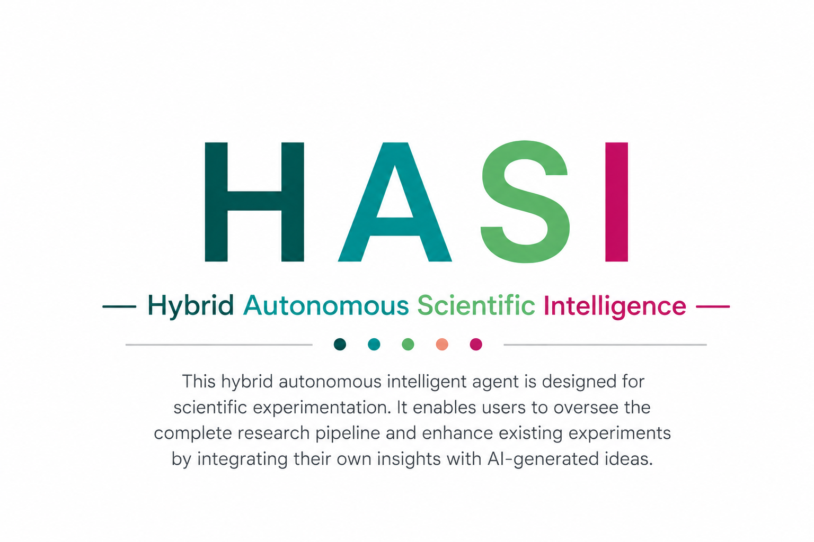

  

<h1 align="center">HASI — Hybrid Autonomous Scientific Intelligence</h1>

  A hybrid autonomous intelligent agent for scientific experimentation.

---

## Extended Abstract

HASI (Hybrid Autonomous Scientific Intelligence) is a hybrid autonomous
intelligent agent designed for scientific experimentation. It enables users to
oversee the complete research pipeline and to enhance existing experiments by
integrating their own insights with AI-generated ideas.

The platform is built around a *human-in-the-loop* philosophy. Rather than
replacing the researcher, HASI acts as a collaborative partner that augments
human expertise with autonomous reasoning. Researchers retain full oversight at
every stage of the pipeline — from hypothesis formulation, through experiment
design and execution, to analysis and interpretation of results — while the
agent contributes candidate hypotheses, proposes experimental configurations,
and surfaces patterns that might otherwise go unnoticed.

By being *hybrid*, HASI deliberately blends two sources of knowledge: the
domain insight and judgment that only a human researcher can provide, and the
breadth, speed, and tirelessness of AI-generated ideation. Users can seed the
system with their own assumptions, constraints, and prior results, and the agent
weaves these together with its own suggestions to refine and extend ongoing
experiments. This makes it possible to build on existing work incrementally
instead of starting each investigation from scratch.

The *autonomous* dimension allows HASI to drive the routine and
computationally intensive parts of the research process — iterating over
parameters, running trials, and aggregating outcomes — so that human effort can
be concentrated where it matters most: on creative direction, critical
evaluation, and scientific decision-making.

In short, HASI aims to shorten the distance between an idea and a validated
result by giving scientists a transparent, controllable, and collaborative
agent that they can guide, correct, and learn from throughout the entire
experimental lifecycle.

## Key Capabilities

- **End-to-end pipeline oversight** — monitor and steer every phase of the
  research workflow from a single platform.
- **Human + AI co-ideation** — combine the researcher's own insights with
  AI-generated hypotheses and experiment ideas.
- **Experiment enhancement** — extend and improve existing experiments rather
  than restarting them.
- **Autonomous execution** — delegate repetitive, large-scale experimental runs
  to the agent while retaining final control.

## License

To be determined.
